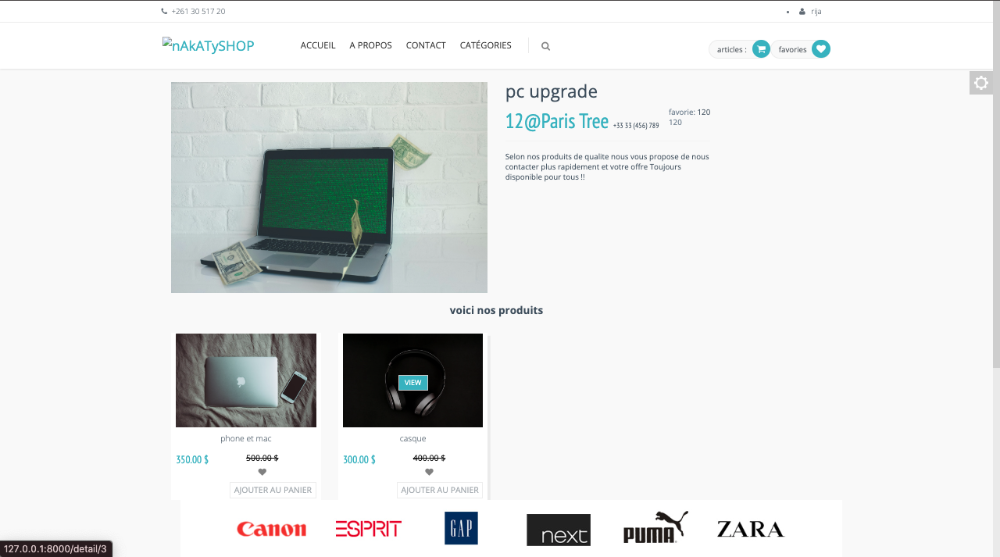
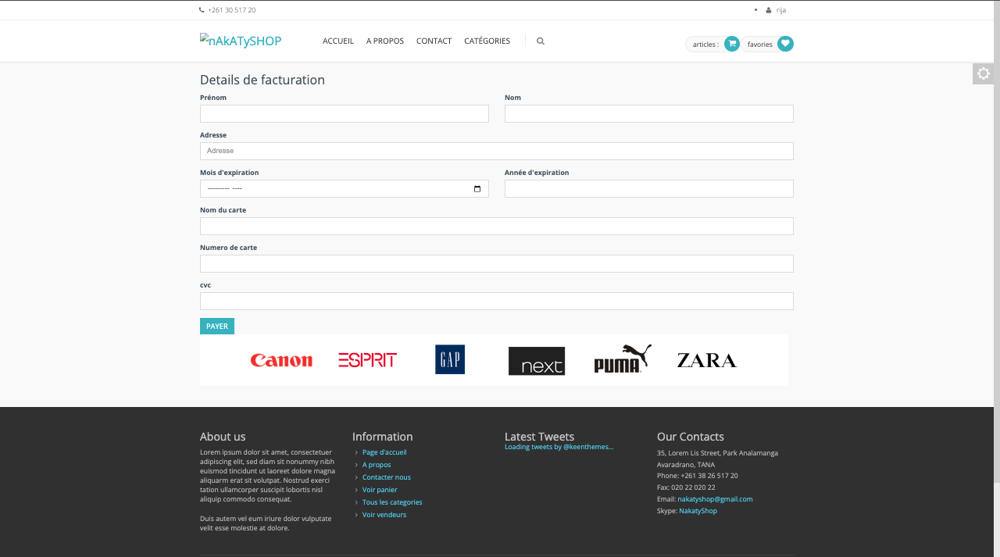
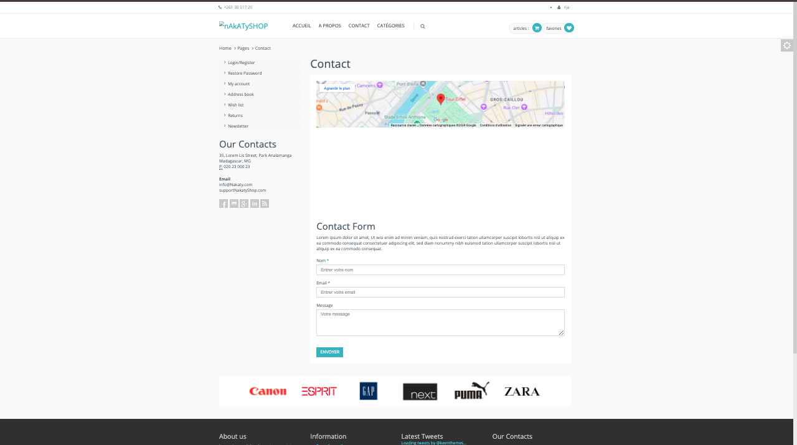
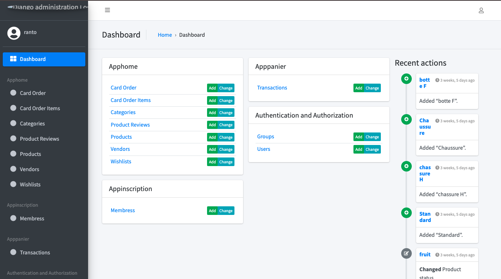
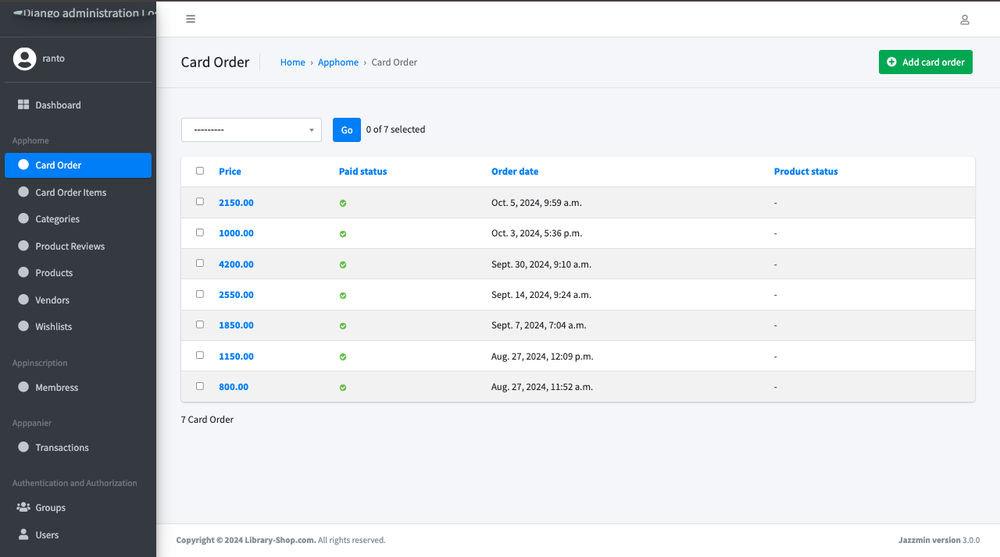
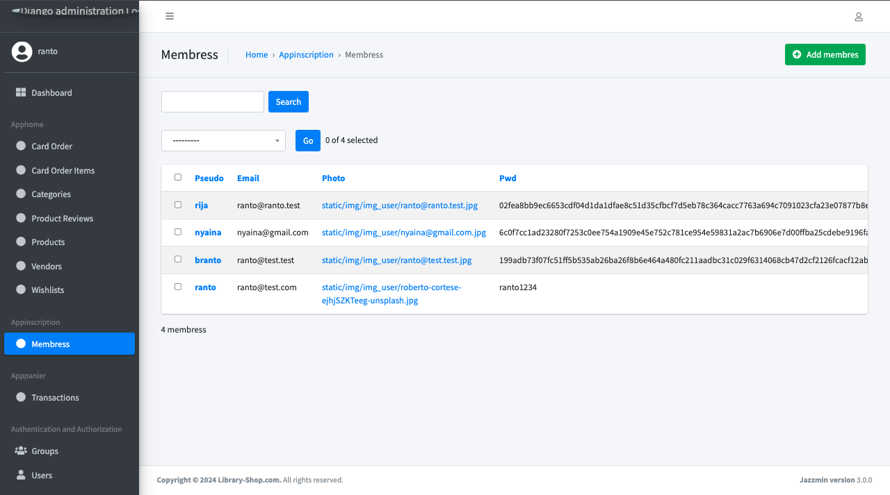

<h1 align="center">Django E-commerce Application</h1>
<h3 align="center">A web-based e-commerce platform built with Django.</h3>

<p align="center">
  <a href="https://github.com/votre-utilisateur/votre-projet-django">
    
  </a>
  <a href="https://github.com/votre-utilisateur/votre-projet-django">
    
  </a>
  <a href="https://github.com/votre-utilisateur/votre-projet-django/blob/main/LICENSE">
    
  </a>
</p>

## Built with

- [Django 5](https://www.djangoproject.com/)
- [Bootstrap](https://getbootstrap.com/)
- [Stripe API](https://stripe.com/)
- [PostgreSQL](https://www.postgresql.org/)
- [Celery](https://docs.celeryproject.org/en/stable/)
- [Redis](https://redis.io/)
- [Node.js](https://nodejs.org/)


# Mon Projet Django

Un projet Django simple pour démontrer les fonctionnalités telles que la gestion des utilisateurs, les paiements Stripe, la wishlist, et plus encore.


## Fonctionnalités

- **Gestion des utilisateurs** : Connexion, inscription, et récupération de mot de passe.
- **Wishlist et Panier** : Ajoutez vos produits favoris.
- **Intégration Stripe** : Paiements sécurisés via Stripe.


## Installation

### 1. Cloner le projet
**Clonez le repository GitHub :**

```bash
git clone https://github.com/ranto404/mon-projet-django.git
cd mon-projet-django

```


### 2. Configuration d'envirennement virtuel
`python -m venv env`
`source env/bin/activate`  # Sur macOS et Linux
`env\Scripts\activate`  # Sur Windows


### 3. Installer les dépendances
`pip install -r requirements.txt`


### 4.Configuration supplémentaire (optionnel)
**Configuration de Stripe (si applicable) :**
Assurez-vous d’avoir vos clés API Stripe configurées dans vos variables d’environnement ou dans votre fichier `settings.py` ou `.env` .

```bash
API_URL='https://api.stripe.com'
DEBUG=True
STRIPE_PUBLIC_KEY="votre-clé-publique-stripe"
STRIPE_SECRET_KEY="votre-clé-secrète-stripe"

```

**Environnement Mailtrap (si applicable) :**

Pour tester l'envoi d'emails, configurer vos identifiants mailtrap dans le fichier `setting.py` ou `.env`

```bash
EMAIL_BACKEND = 'django.core.mail.backends.smtp.EmailBackend'
EMAIL_HOST = 'smtp.gmail.com'
EMAIL_PORT = 587
EMAIL_USE_TLS = True  # que ce paramètre est défini
EMAIL_HOST_USER = "nom d'utilisateur Mailtrap" 
EMAIL_HOST_PASSWORD = "mot de passe Mailtrap (celui masqué ici)"
DEFAULT_FROM_EMAIL = EMAIL_HOST_USER 

```


### 5. Créer un superutilisateur

**Créez un compte administrateur pour accéder à l’interface d’administration :**
`python manage.py createsuperuser`


### 6. Lancer le serveur de développement
`python manage.py runserver`


### 7. Accéder à l'application
**Ouvrez votre navigateur et allez à l'adresse suivante pour voir votre application :**
    
(http://localhost:8000/)


## Captures d'écran


















## Licence

    Ce projet est sous licence `MIT`.


